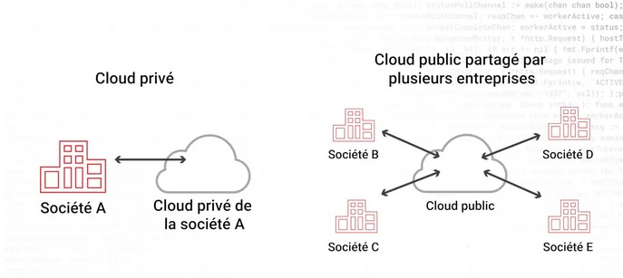
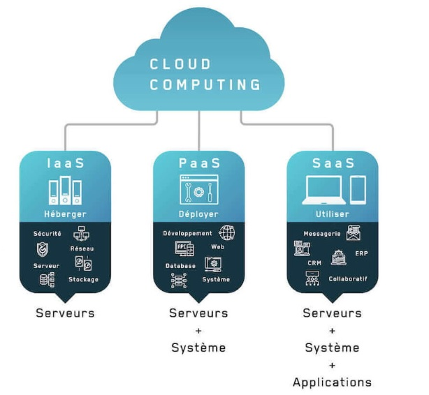

# Sensibilisation

## "Cloud Pi Native" en 3 minutes ("elevator pitch")
Usager, citoyen, agent, responsable politique, chacun peut mesurer l'écart entre les services numériques publics et ceux que proposent (souvent "gratuitement") les grands acteurs privés du numérique: plus simples d'accès et d'utilisation, plus fiables, plus évolutifs, etc. "Cloud Pi Native" c'est l'offre de services du MIOM, ouverte à l'interministériel, pour fournir les moyens de produire des applications de qualité, sécurisées et souveraines (maitrise des dépendances).

Conforme à la doctrine "cloud au centre", cette offre vise à tirer la pleine puissance du Cloud pour transformer le numérique public. Elle s'appuie sur un socle technologique à l'état de l'art, conçu pour le cloud ("cloud native") permettant la maitrise des standards des produits numériques "en amont" (sécurité des données, RGPD, accessibilité, impact environnemental... ), en plus de légiférer sur les conséquences/activités "en aval".

A travers un parcours unique, les produits numériques existants ou en cours de conception, pourront bénéficier: de l'hébergement sécurisé sur le Cloud Pi souverain, d'une usine logicielle permettant de déployer et gérer les produits de facon fluide et d'un cadre normalisant la gestion des produits tout au long du cycle de vie. Les équipes utilisatrices de l'offre bénéficieront d'un accompagnement adapté, jusqu'à l'autonomie. L'offre participe ainsi de la maitrise du patrimoine numérique en gagnant en intégration, en visibilité, en rationnalité.

## Format de la présentation
Pas de prérequis techniques, 30 minutes de présentation/15 minutes de questions

## A quelles questions est-ce que la présentation répond?
1.	Qu’est ce que l'on appelle "nouveau monde numérique"? Pourquoi parle t-on de "cloud native"? Quel est l'enjeu pour le numérique public?
2.	Qu'est ce que la doctrine « cloud au centre »? A quelles enjeux répond-elle et avec quels leviers? quels aspects de la stratégie numérique ministérielle? 
3.	Qu'est ce qu'on appelle les technologies "cloud native"? Quel lien avec "le cloud"? Qe peremttent ces technologies? 
4.	Qu'est ce que contient l'offre "Cloud Pi Native" du MIOM? Que peut-elle apporter à mes projets? Comment peut-on en bénéficier?

### Quel est l’enjeu à transformer la production du numérique public?
Les domaines d’activités se font « disrupter » un à un par des nouveaux acteurs du numérique: banques, information, transports, sociabilité, hotellerie/tourisme... Un "nouveau monde numérique" a émergé, en évolution rapide et complexité croissante.

Paradoxalement, cette complexité technique s'accompagne d'une grande simplicité d'accès et d'une qualité technique qui les rendent extrèmement concurentiels. Les utilisateurs de Facebook, Google Docs, Netflix, ... ont pris l'habitude de la simplicité d'utilisation (outils sans mode d'emploi), de la fiabilité (pas d'interruption de service) et de la continuité de l’expérience (pas de "Facebook 2.0").

Les usagers, dont les agents publics, ne comprennent pas pourquoi les produits proposés par l'Etat ne sont pas au niveau de ce qu’ils utilisent en tant que consommateurs. C'est ce qui explique que les acteurs du "nouveau monde numérique" ont peu à peu imposé des standards "de fait" y compris sur des points relevant en principe de domaines régaliens (statut des données personnelles, certification de l'identité, émission de monnaie...). Pour cela les acteurs du "nouveau monde numérique" se sont appuyé sur: 
1) de nouvelles technologies de passage à l'échelle 
2) de nouveaux modes de production plus efficaces 
3) de nouvelles normes culturelles portées par le modèle commercial (ex: donnée) et les caractéristiques techniques(ex: ubiquité)

Tout cela est porté par des technologies qui s'appuient sur le cloud: les maitriser c'est se donner les moyens de produire et diffuser un numérique public souverain pour  passer de la régulation DU numérique à la régulation PAR le numérique. Grace à un niveau de qualité technique et des standards (SSI, RGPD, accessibilité, impact environnemental... ) conformes à ses lois et valeurs, l'Etat ne régule pas seulement l'aval (les activités générées par le numérique) mais l'amont (les outils par lesquels sont générées ces activités).

### Pourquoi mettre le « cloud au centre », comme le préconise la doctrine ? 
La crise covid l'a montré: sans la puissance du cloud, la bascule massive vers les outils numériques ayant permis l'essor du télétravail aurait été impossible. Dans le même temps, qu'ils bénéficaient de la robustesse de services essentiels à leur activité, des millions d'utilisateurs se sont posé des questions sur le devenir de leur données personnelles. Il y a donc des opportunités, mais aussi des enjeux très forts autour du cloud. 

La doctrine « cloud au centre » vise à fournir un cadre pour moderniser l'action publique par une nouvelle génération de services numérique répondant aux enjeux de :
1) Transformation : pour pouvoir réaliser un passage à l’échelle fiable des services numériques à un coût marginal faible, mettre en place de nouvelles approches focalisées sur l'usager et permettant l'évolutivité (DevOps et mode produit) en facilitant l'accès/expérimentation, rationnaliser les ressources pour la sobriété numérique, innover en mettant en intégrant l'IA et le big data dans les services numériques... 
2) Souveraineté: pour atteindre la sécurité et l'immunité aux droits extra-UE en augmentant la marge de négociation avec ses fournisseurs, réduire les dépendances et les verrouillages en facilitant le fait d'en changer (réversibilité), faciliter l'accès aux technologies les plus récentes en resant ouverts (services cloud innovants)...
3) Accélération: pour alimenter le catalogue de solutions UE en facilitant le regroupement de clients aux interets partagées, soutenir les industriels et renforcer l'autonomie des filières UE en choisissant les meilleurs normes et standards...

Pour répondre aux enjeux, cette "posture cloud" doit être déclinée comme un "mode par défaut" dans la stratégie numérique des ministères. C'est à dire  l'ensemble des opérations touchant aux services/produits numériques:
1) D’acquisition et consommation
2) Développements internes
3) Sous-traitance 

### Mais d'abord, qu’est ce que le cloud? et le "cloud native" ? 
Pour concrétiser ces enjeux, le cloud (ou "cloud computing") designe l'ensemble des technologies permettant à un utilisateur d'utiliser à distance des ressources informatiques/machines partagées (qui sont tout à fait "matérielles"). Le "Cloud" peut: 
- Etre public: c'est à dire partagé avec des utilisateurs qui ne sont pas propriétaires des machines;
- Etre privé: c'est à dire partagé au sein de l'organisation propriétéaire des machines;
- Etre hybride: utilisant des ressources publiques et privés;

Les services proposés doivent répondre à [5 caractéristiques](https://nvlpubs.nist.gov/nistpubs/legacy/sp/nistspecialpublication800-145.pdf) pour être à proprement parler "du cloud":
- Accès aux services à la demande, ergonomiquement facile par l’utilisateur
- Accès techniquement performant via un réseau large bande
- Disposer d'un large réservoir de ressources (géogrpahiquement)
- Redimensionnement rapide (élasticité) en adaptant "instentanément la puissance de calcul au trafic
- Facturation à l’usage: l'utilisateur paie le cout "marginal" d'utilisation des ressrouces (pas la mise en service)

Pour réaliser ces caractéristiques, il existe différents [modèles de partage reponsabilités entre le fournisseur Cloud et l'utilisateur](https://www.redhat.com/fr/topics/cloud-computing/public-cloud-vs-private-cloud-and-hybrid-cloud#questions-fr%C3%A9quentes): ce sont les types IaaS, PaaS, Saas (ex: en IaaS, c'est un fournisseur qui toute l'infrastructure. En Saas, il gère tout de A à Z). C'est en proposant un haut niveau de qualité et de fiabilité de ces services que les acteurs du "nouveau monde numérique" dominent le monde numérique et ont imposé leur sandards (ex: sécurité, régime juridique, protection des données, ...)

Pour concretiser ces promesses, leurs infrastructures et leurs applications ont du être pensées pour le cloud dès leur conception. D'ou le terme de technologies "cloud native" (née du cloud).  Schématiquement on met essentuellement d'accent sur celles qui permettent de: https://www.redhat.com/fr/topics/cloud-native-apps:
1) Consommer du cloud de facon très automatisée avec un maximum d'autonomie et de fiabilité: **"kubernetes" et les conteneurs**; 
2) Interconnecter les applications entre elles pour augmenter la valeur des données et fonctionnalités: **les API**;
3) Rendre les applications plus modulaires et indépendantes pour l'évolutivité, la résilience: **les microservices**;
4) Standardiser et automatiser des approches de co-construction entre clients/métiers, Dev, Ops, Sec, ... pour mettre en place un meilleur partage des responsabilités et une meilleure autonomie d'utilisation: **les usines logicielles DevOps (ou DevSecOps)**;

Par extension, les leviers méthodologiques et culturels https://blog.octo.com/cloud-enjeux-2023/ ... mobilisés autour de ces technologies sont qualifés de "cloud native". C'est pourqui on l'utilise aussi comme un nom: "LE cloud native", pour désigner le paradigme de ces technologies.

### Qu’est-ce que l’offre Cloud Pi Native ?
Par le numrique, le monde est en transformation et il est nécessaire de remettre le "cloud au centre" pour mitriser la complexité générée. "Cloud Pi Native" c’est une offre du MIOM qui vise à mettre les leviers technologiques, méthodologiques et culturels du « cloud native » pour le faire, à portée des acteurs interministériels. 

Celle-ci comprend :
- **Le Cloud souverain "Pi"**, adaptée à l’hébergement de données sensibles (NP et DR) jusqu’au niveau Diffusion restreinte grace à des infrastructures opérées par le ministère de l’Intérieur. Il est aussi plus souple et résilient dans son utilisation grace à kubernetes. 
- **Un cadre de normes** qui s'impose à tous pour guider la mise en place des principes du "cloud native" tout au long du cycle de vie des produits numériques. Il vise à mettre en cohérence l'ensemble des principes, normes et exigences applicables aux produits numériques, dès la conception .
- **Un accompagnement** pour la montée en compétence des équipes afin atteindre un degré le plus d'autonomie possible dans la maitrise de ses responsabilités;
-	**Un socle de production DevSecOps**, chaine qui va permettre de déployer le code d'une application sur le cloud pour la faire "tourner". Celle ci permet de réduire les frictions et assurer une continuité tout au long du cycle de vie des produits: de la construction, à la mise en production, à la maintenance/évolution, au décommisionnement.

Toute les produits numériques sortent de la même usine et sont gérés selon un flux standardisée ce qui permet: 
- **de s'assurer de la confomité des développements**, notamment sous-traités (80% du numérique public) grace à la centralisation des dépots de code et du suivi du projet (backlog) ainsi qu'à l'automatisation des tests que l’on peut rejouer;
- **de maîtriser la confiance au sein de mon organisation** en fournissant les garanties automatiquement AVANT de déployer sur le cloud (vérification des certificats, homologation continue,...) et en sectorisant une fois sur le cloud.
- **de faciliter la gouvernance**: via l'offre d'observabilité et la garantie du cadre de norme, on bénéficie d'une meilleure intégration et d'une vision "tour de controle" sur le patrimoine applicatif et son activité;
- **d'augmenter la proximité** entre l'ensemble des parties prenantes des produits numériques, d'un bout à l'autre sur une chaine unique, aprouvé et automatisée. Cela permet des cycle de développement beaucoup plus courts et la possibilité d'expérimenter rapidement pour réajuster (sur les plans technique ET métier);
- **de rationaliser les couts**: via le choix des hébergements en fonction des contraintes, la mutualisation des couts à un niveau interministériel, "Inutile de prendre du cloud souverain pour des données ouvertes".
- **de favoriser la transparence et l'ouverture**: contrairement à l'approche de certaines gros acteurs du numériques, nous avons opté pour une approche open soource car nous pensons que la complexité doit être dévoilée de facon adaptée à la montée en compétences de toutes les parties prenantes et faciliter l'appropriation des outils par les producteurs du numérique public.

## Comment l'utiliser? 
L'offre existe, elle est disponible et est développée en méthode agile : nos utilisateurs sont des partenaires qui bénéficient des avantages du service et contribuent à son évolution.

# Reste à faire, pistes d'amélioration
- Préciser le périmètre pour lequel l'offre est pertinente: quelles systèmes/applications ont vocation à l'utiliser? Les nouvelles pour des questions de mise à l'état de l'art, mais quid des anciennes? Retex: Nubo, Cloud centre, Commission Européenne, CRiP
- Combien ça coute/qu'est ce que ca permet de gagner? Notamment dans le cadre de la LOPMI, beaucoup de développements= beaucoup de MCO à prévoir demain. Penser au cout du "montage de l'usine".Modèle économique: quels sont les modèles économiques et modes de contractualisation (accords de service) possibles?
- Est-il possible de s’appuyer sur le témoignage d'un prescripteur? Retex: ministères ayant basculé sur ce type d'offre: MTE, MJ, MinArm, Educ. Nat. Aller chercher les arguments rationnels et impactants
- Petite intro: qu'est ce que le cloud? (figure?)
-	Moyen de mesurer la réussite (ou non) de la session (OKR) ou le NPS (recommanderiez-vous cette offre-> NPR) 1) intro :  2) sondage sur les connaissances actuelles 3) présentation 4) "s'il ne fallait retenir qu'une chose" 5) quizz et collecte des retours (comment avez-vous trouvé... ? qu’est ce qui a manqué pour vous convaincre ? )
-	Alimenter en exemple du quotidien, qui marche, reposant sur le paradigme "Cloud Native" : Google (Borg), Netflix, ... vs. des exemples de ce qui marche moins bien (banque ou assurance traditionnelles, ...)
-	Démystifier la sécurité (argument développés dans les présentations de "Cloud au centre"): elle est différente pur un individu et à l'échelle d'un acteur "géostratégique" https://medium.com/@ismaelbouarfa/s%C3%A9curit%C3%A9-cloud-vs-s%C3%A9curit%C3%A9-on-premise-b6e742bf7b7b

 

