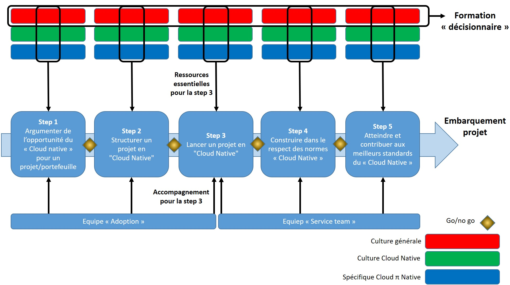

Les ressources rassemblées ici constituent une base de connaissances permettre aux équipes clientes d'acquérir rapidement un maximum d'autonomie sur [l'offre "Cloud Pi Native"](https://dnum-mi.github.io/). Dans une logique d’amélioration continue, vous pouvez proposer vos commentaires en:
- Faisant des pulls request sur le repository 
- Faisant des issues

# Ressources mises à disposition dans cette section

Les "clients" souhaitant comprendre et consommer l’offre Cloud Pi Native, pourront bénéficier d'accélérateurs:
- **Des ressources d'autoformation** organisées par niveau de maturité (i.e. type de questions); 
- **Un processus d'embarquement** organisé par étapes (accompagnement actuellement réservé aux usagers ministériels);

Nous proposons ici des parcours de facilitation en se basant sur les hypothèses suivantes: 
- Hypothèse 1: l'alignement des `niveaux de maturité` avec les `étapes d'embarquement` permet de focaliser la formation sur la prise en main de l'offre.
- Hypothèse 2: l'alignement de `parcours-type` avec le `type de responsabilités` exercées permet à chacun d'identifier 1) son role dans l'organisation à mettre en place pour consommer l'offre 2) d'identifier des ressources de formation pour s'y préparer.

## Comment utiliser ces ressources?

Les ressources peuvent etre utilisées, étape par étape, de deux manières:
1) **Pour embarquer rapidement une équipe projet:** en consultant une sélection de "ressources essentielles" pour compléter l'étape (voir les étapes ci-après) ;
2) **Pour se former individuellement:** en consultant les ressources approfondies relevant d'un périmètre de responsabilité donné (voir les périmètres ci-dessous). 

## A qui s'adresser?
Le dispositif d'accompagnement proposé par le programme Cloud Pi Native est animé par deux équipes :
- `L'équipe "adoption"` qui renseigne sur l'offre et oriente sur les ressources de formation; 
- `La "service team"` qui accompagne au lancement du projet à partir de l'étape 3 (réservée aux clients ministériels).

L'effort étant plus important, **à partir de l'étape 3, l'accompagnement est conditionné à la vérification de prérequis techniques stricts**, car nécessaires à la réussite du projet (cf. [liste des prérequis](https://github.com/cloud-pi-native/documentation)).

# Se former individuellement: périmètres de responsabilité

Toute personne désireuse de se former à titre individuel est priée de prendre connaissance du [support de sensibilisation aux enjeux](./sensibilisation.md). Il s'agit du point de départ commun aux parcours de formation et au processus d'embarquement. 

Des ressources d'autoformation sont ensuite disponibles à chaque `étape d'embarquement/niveau de maturité` en plus des ressources essentielles. Elles sont distinguées par `parcours/responsabilités`: 

1) **"Spécifiques à Cloud pi native/équipes techniques"**: documentation destinée aux équipes techniques responsables de l'utilisation de l'offre pour construire, opérer et gérer des produits numériques tout au long de leur cycle de vie. 
> Elles sont responsables de la qualité des produits. Selon la taille et de l'organisation, ce périmètre peut recouvrir des personnes responsables de la fiabilité des services & des systèmes (plateformes de services, pipelines de livraison DevSecOps, services d’hébergement, environnements, réseaux, etc.). Exemples: développeurs, opérateurs, DevOps, SRE, architectes solution, etc.

2) **"Culture cloud native/pilotage MOE"**: ressources notamment destinées aux personnes responsables de la structuration d'un plan projet (compétences, roles, organisation, technologies, ..) son organisation et son suivi (consommation budgetaire, UO, livrables, ...), pour saisir les opportunités du paradigme "cloud native".  
> Elles pilotent des équipes assurant le développement ou les opérations sur les produits et sont responsables de l'intégrité des projets (cadrage, bonne utilisation et suivi des ressources, orientations techniques...). Exemples:  pilotage/chefferie de projets/programmes, responsables d'unités de conception, de bureaux d'étude, MOE, etc.

3) **"Culture générale/gouvernance"**: ressources adressées à tous, notamment aux personnes responsables de l'orientation de projets numériques vers une offre  de service donnée pour comprendre les spécificités du "nouveau paradigme logiciel". 
> Elles sont responsables de la pertinence des décisions stratégiques ce qui recouvre, plus largement, les personnes chargées de les conseiller. Exemples: pilotage et gouvernance des organisations, directions générales ou métiers, stratégie d'achat, stratégie RH, etc.

Les équipes d'accompagnement du programme programme Cloud Pi Native peuvent aussi conseiller des ressources spécifiques en fonction des besoins et de la maturité de l'équipe projet.

# Embarquement d'une équipe: étapes & ressources

## Etape 1: juger de l'opportunité de l'offre Cloud Pi Native, argumenter son besoin

>**Objectif et étapes clefs**: L'équipe sait évaluer et argumenter la pertinence (ou non) à orienter son projet vers l'offre Cloud Pi Native
>- Prendre connaissance des éléments nécessaires à la compréhension de l'offre ([support de sensibilisation aux enjeux](./sensibilisation.md), [page de présentation](https://dnum-mi.github.io/), [CCT Cloud Native](./cloud-pi-native/CCT-Cloud-Native))
>- Compléter le diagnostic flash permettant de préqualifier son besoin (en autonomie ou dans le cadre d'un entretien) et l'adresser au programme Cloud Pi Native

>**Livrable à constituer et ressources**: ["diagnostic flash" (trame de préqualification)](./diagnostic-prequalification.md), ressources de [sensibilisation](./sensibilisation.md)

>**Critères go/no go:** la demande est suffisament claire pour attester que l'offre de service Cloud Pi Native répond de manière pertinente au besoin exprimé

## Etape 2: structurer un plan projet, se préparer pour consommer l'offre

>**Objectif et étapes clefs**: L'équipe sait à quoi l'engage le respect des normes du CCT Cloud Native et s'organise pour consommer l'offre
>- Consulter les ressources de formation mise à disposition (voir ci dessous) et les [exemples existants](https://software.af.mil/wp-content/uploads/2019/12/DoD-Enterprise-DevSecOps-Maturity-Review-v1.6.docx)) pour évaluer le degré de préparation de son projet: vérification des prérequis organisationnels (compétences, roles, ...) et techniques (complexité, technologies, ...), compréhension du cadre de normes, évaluation des éventuels besoins de formation...
>- Compléter autant que possible le [modèle de plan projet](./modele-plan-projet.md) 
 
>**Livrable à constituer et ressources**:[plan projet (trame de qualification)](./modele-plan-projet.md), ressources pour [préparer son projet](./formation_step2.md)

>**Critères go/no go:** l'équipe est suffisamment prete pour un entretien d'accompagnement technique 

## Etape3: lancer son projet, construire dans un environnement sandbox "Cloud native"
>**Objectif et étapes clefs**: L'équipe s'est organisée et exercée à prendre en main des technologies cloud native. Elle a ensuite réalisé un "Hello world" avec les éléments de l'offre, puis mis en place son usine logicielle dans un environnement bac à sable pour construire sont projet (découverte et mise en place de la chaine primaire).

>- Entretien avec l'équipe d'accompagnement technique: passage en revue des prerequis, prise de connaissance des contexte métier et technique, évaluation des ressources à provisionner,... détermination d'une roadmap d'accompagnement
>- Demandes d'ouverture des accès à la console Cloud Pi Native (valant engagement à respecter le cadre de normes) et des canaux d'aides
>- Prise en main de l'offre: réalisation d'un "hello world", construction de son usine logicielle, déploiement d'un POC déployé dans l'environnement "bac à sable", construction d'un MVP du produit

>**Livrable à constituer et ressources**: MVP dans l'environnement bac à sable (console + SecNumCloud), ressources pour [lancer son projet](./formation_step3.md)

>**Critères go/no go:** les tests réalisés sur une version suffisemment représentative du produit attestent que le cadre de normes est respecté

## Etape 4: passer en production, appréhender le Cloud souverain "Pi"
>**Objectif et étapes clefs**: L'équipe construit son projet et le déploie dans l'environnement du Cloud Pi souverain, dans le respect du cadre de normes imposé (découverte et mise en place de la chaine secondaire).

>- Réaliser une [demande d'hébergement sur le Cloud Pi](https://resana.numerique.gouv.fr/public/document/consulter/7054535)
>- Provisionner ses ressources, accéder à l'usine logicielle et les déployer sur le Cloud Pi
>- Déployer son produit (codes infra et applicatif) sur l'environnement de production

>**Livrable à constituer et ressources**: produit numérique dans l'environnement de production, ressources pour [passer en production](./formation_step4.md)

>**Critères go/no go:** les métriques d'observabilité et les rapports sur le produit attestent de sa conformité aux standards de qualité et de sécurité

## Etape 5: atteindre les meilleurs standards, évoluer en production 
>**Objectif et étapes clefs**: L'équipe construit, opére et fait évoluer ses produits en autonomie. Les produits livrés en production sont conformes aux meilleurs standards de qualité et de sécurité. Elle a mis en place des bonnes pratiques et les monitore pour s'assurer de leur continuité.

>- Mettre en place les bonnes pratiques et les moyens de leur suivi

>- Assurer la continuité de service et des bonnes pratiques lors des évolutions du produit 

> **Ressources:** [évoluer en production](./formation_step5.md)

