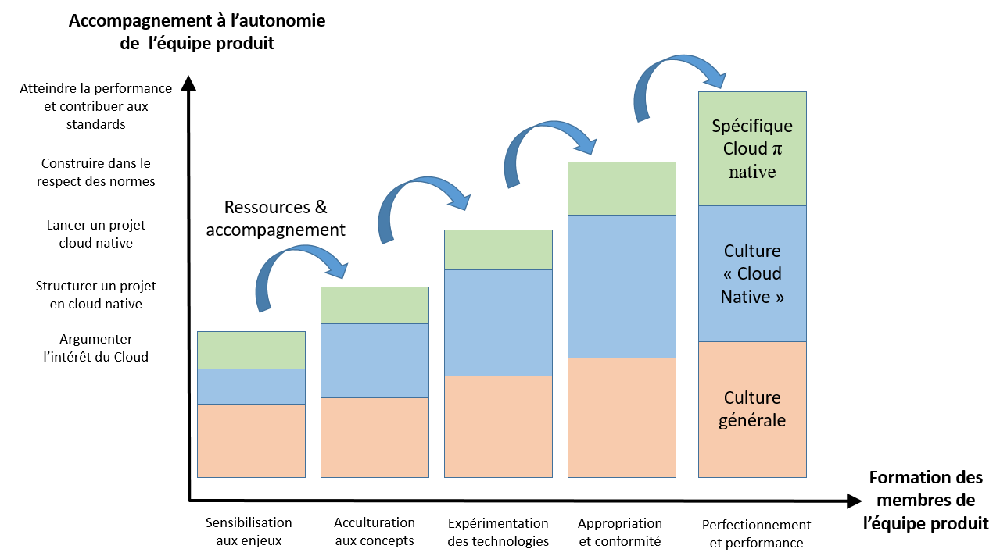

Les ressources rassemblées ici constituent la base de connaissances accessibles de [l'offre "Cloud Pi Native"](https://dnum-mi.github.io/). Nous proposons 1) une sensibilisation aux enjeux adressés 2) une formation, un apprentissage à la maitrise des ressources proposées 3) une acculturation à l'utilisation du socle via des kits de prise en main. Dans une logique d’amélioration continue, vous pouvez proposer vos commentaires en:
- Faisant des pulls request sur le repository
- Faisant des issues

# Utilisation de l'offre
Un équipe projet souhaitant consommer l’offre cloud pi native pourra **bénéficier d'un accompagnement**. Celui-ci regroupe des activités assurées par les équipes du programme Cloud Pi Native et des ressources de formation, en vue d'atteindre l'autonomie de l'équipe projet. Celui-ci est adapté à:
- [Au degré de maturité de l'équipe](./2.6-plan_formation.md): structuré par le type de questions qu'elle se pose en l'état d'avancement actuel de son projet.
- [L'avancement du projet](https://github.com/dnum-mi/dso-formation/blob/a5c2755f51999042e0a14c06c7536ba067745ba3/2.5-accompagnement_projet.md):  structuré en niveau de réalisation atteint avec Cloud Pi Native ;

## Accompagnement et prérequis 
Si les ressources de formation sont consultables librement, **l'accompagnement est conditionné à certains pré-requis**, nécessaires pour garantir l'atteinte de l'étape suivante du projet. Ces prérequis sont constatables sur la base de réalisations("avez vous déja....?"). En fonction, les équipes du programme Cloud Pi Native se réservent le droit:
- [D'accompagner](https://github.com/dnum-mi/dso-formation/blob/5560e4cbb7928c19cac3955be0569f15304cd367/2.5-accompagnement_projet.md): voir les activités d'accompagnement et le point de contact, en fonction de l'étape du projet et des besoins; 
- [De proposer des ressources de formation adaptées](https://github.com/dnum-mi/dso-formation/blob/5560e4cbb7928c19cac3955be0569f15304cd367/2.6-plan_formation.md): voir les contenus 1) de culture générale 2) de culture « cloud native" 3) spécifiques à cloud pi native en fonction du type de questions posées par l'équipe projet;

Selon le profil des personnes impliquées et l'avancement du projet, des **parcours de formation spécifiques** pourront être proposés. En préalable à toute demande d'accompagnement, il est conseiller de consulter le [support de sensibilisation](https://github.com/dnum-mi/dso-formation/blob/2a0a4836804fc00fde436035559c7ca07cb9a47e/0-sensibilisation.md)

# Pourquoi Cloud Pi Native? enjeux de transformation du numérique public
### Un "nouveau monde" logiciel a émergé
Ces 10 dernières années la puissance d'intermédiation du numérique a capté/dévoré une part croissante des activités humaines. Transport, banque, finance, sociabilité, hotellerie, logistique, sécurité, identité, culture, divertissement... deviennent numériques.  Les causes d'un tel changement ne sont pas seulement technologiques: elles ont trait aux organisations, responsabilités, normes (y compris culturelles) de la production numérique. C'est un changement de paradigme complet, un ["nouveau monde logiciel"](https://pi.interieur.rie.gouv.fr/nouveau-monde-logiciel/).

### Le service public est mis au défi
Dans ce nouveau cadre, certains produits/services deviennent des « normes de fait »: les décisions les concernant, leurs caractéristiques, impactent des millions d'utilisateurs ce qui pose des [défis importants aux organisations publiques](https://github.com/Yoarmi/dso-formation/blob/patch-1/1.3-defis_service_public.md). Pour rester au service de leurs usagers et agents, en particulier sur leurs missions régaliennes, ces dernières doivent s'approprier les moyens techniques, organisationnels (production, opération, maintenance, ...) et les normes techniques ou non-techniques (neutralité, RGPD, accessibilité,...) du "nouveau monde" numérique. C'est à ces défis que visent à répondre les doctrines [cloud au centre de l'Etat](https://www-lemagit-fr.cdn.ampproject.org/c/s/www.lemagit.fr/actualites/365531732/Cloud-souverain-la-DINUM-contextualise-les-exigences-de-la-France?amp=1) et [cloud de confiance](https://www.ssi.gouv.fr/actualite/secnumcloud-evolue-et-passe-a-lheure-du-rgpd/).

### Remettre "l'usager au centre"
Pour réussir un projet de transformation au service des usagers, la production du numérique public doit être organisée ["en mode produit"](https://6695516.fs1.hubspotusercontent-na1.net/hubfs/6695516/Culture_Produit_Web_Extrait.pdf?__hstc=154216807.d3e24310b08a19eb0fbdb060971025e2.1671555363753.1671555363753.1675700990863.2&__hssc=154216807.2.1675700990863&__hsfp=1771427427&hsCtaTracking=3562120f-8ddc-4973-8c94-6fc9bd6753e2%7C5eb7f077-d1f7-422e-9a12-ab4e2311abe6) (évolutivité, disponibilité) en incluant les développeurs, usagers trop souvent oubliés. La voie que nous privilégions pour cela emprunte aux technologies ["cloud native"](https://github.com/Yoarmi/dso-formation/blob/patch-1/1.2-technologies-cloud-native.md) (conteneurisation/orchestration, API, microservices) et aux approches [DevSecOps](https://github.com/Yoarmi/dso-formation/blob/patch-1/1.1-approche_devsecops.md) (culture de responsabilités partagées). 

Comme expliqué dans le [cadre de cohérence technique Cloud Native (CCT)](https://github.com/dnum-mi/CCT-Cloud-Native), l'offre Cloud Pi Native vise à "industrialiser" cette approche et l'implémenter dans un flux de production continue, intégré et optimisé (lean), suffisament ouvert pour pouvoir évoluer en continu (agile). Cloud Pi Native constitue donc un modèle-socle d'usine logicielle "lean-agile". 

# Compréhension de Cloud Pi Native
Nous souhaitons faciliter l'action de l'ensemble des acteurs désireux de contribuer à la transformation numérique du service public. Pour cela, nous répondons aux questions 1) quels sont les principes directeurs et modèles d'organisations nécessaires à l'utilisation du socle ? 2) Quels sont les prérequis théoriques (concepts) et pratiques pour l'utiliser? 3) Quel est le degré de préparation de mon équipe?

### Présentation de l'écosystème et socle technique "Cloud Native"
Comme dans toute transformation industrielle découlant d'innovation(s) majeure(s), les responsabilités des acteurs en place sont profondément modifiées. nous proposons un [modèle opérationnel](https://github.com/Yoarmi/dso-formation/blob/patch-1/2-modele_organisation.md) pour comprendre l'articulation des différents périmètres de responsabilité et tirer pleinement parti du socle cloud Pi native. 

Nous vous invitons à prendre connaissance des principes sous-jacents exposés dans le [cadre de cohérence technique Cloud Pi Native (CCT)](https://github.com/dnum-mi/CCT-Cloud-Native) et à y contribuer. De ces principes découleront les exigences technologiques, organisationnelles, bonnes pratiques, processus... préconisés pour livrer des produits numériques à l'état de l'art et les gérer tout au long de leur cycle de vie.

### Périmètres de responsabilité
Les parcours d'apprentissage s'adressent aux populations concernées par 4 grands périmètres de responsabilités:
- « [Qualité des produits numériques](https://github.com/Yoarmi/dso-formation/blob/patch-1/2.1-parcours-produit.md) » : personnes qui élaborent de nouveaux produits numériques et/ou assurent la gestion de leur cycle de vie. Ils sont responsables de leur développement, mise en production, MCO/évolution, migration, etc. Ce sont les développeurs, opérateurs de produits, les architectes solution, … 
- « [Fiabilité des services & systèmes (SRE)](https://github.com/Yoarmi/dso-formation/blob/patch-1/2.2-parcours_systeme.md) » : personnes qui assurent l’intégrité des services et systèmes nécessaires aux équipes de développement et d'opération des produits numériques, tout au long de leur cycle de vie: pipelines de livraison DevSecOps, services d’hébergement, génération d’environnements, etc. Ce sont les system teams, les équipes d’ingénierie de fiabilité des sites (SRE, Site Reliability Engineering), les forges, les opérateurs de plateformes (IaaS, PaaS, XaaS, ...)...
- « [Intégrité des projets](https://github.com/Yoarmi/dso-formation/blob/patch-1/2.3-parcours_projet.md) » : personnes qui pilotent les équipes de développement ou de gestion des opérations. Elles sont responsables du cadrage des projets, de la bonne utilisation et du suivi des ressources (humaines et techniques), des orientations à prendre pour la menée d'un projet. Il s'agit des équipes de pilotage/chefferie de projets ou de programmes, de MOE ou d'unités de conception, de bureaux d'étude, etc.
- « [Pertinence de la décision stratégique](https://github.com/Yoarmi/dso-formation/blob/patch-1/2.4-parcours_strategie.md) » : personnes qui prennent des décisions, se portent garantes de l’engagement des organisations sur des sujets touchant au numérique. Ce périmètre comprend également les personnes chargées de les conseiller quand à la stratégie à adopter, de fournir des recommandations, de délivrer des mandats ou de réaliser des arbitrages concernant les finalités, moyens et modes d’organisation. Il s’agit de la décision stratégique, du pilotage et de la gouvernance des organisations, des directions générales ou des directions de stratégie métiers, achats, RH, etc.

### Apprentissage tout au long du cyle de vie du projet  
Avant de se lancer, un "diagnostic" est nécessaire pour définir les formations et l'accompagnement approprié. Nous proposons des outils pour permettre à l'équipe utilisatrice de se situer en termes de connaissances, de compétences et d'appropriation des outils pour tendre vers le plus d'autonomie possible. Cela passe par un dispositif d'accompagnement tout au long du cycle de vie du projet et à la mise en place d'un plan de formation.
 
 
# Prise en main de Cloud Pi Native
Nous pensons que toute personne désireuse de contribuer à la transformation numérique du service public (agent, citoyen, industriel du numérique, représentant d'institutions publiques... ) doit pouvoir rapidement tester le socle et se familliariser avec son utilisation. Pour cela, nous mettons à disposition les souches logicielles et la documentation du socle, mais également des kits de démarrage: tutoriels, formations "hands-on" (par la pratique) et bacs à sable (sandbox). 

### Contextes d'utilisation de Cloud Pi Native
- **Acteurs ministériels ("internes")**: à terme, l'offre Cloud Pi Native sera consommable avec le maximum d'autonomie depuis le réseau interministériel d'Etat via le [catalogue de services](https://pi.interieur.rie.gouv.fr/home-dnum/cloud-%cf%80/qui-sommes-nous/cloud-native/). Pour l'heure, elle est en co-construction en agilité avec ses partenaires-clients et le code du socle est disponible en open-source.
- **Autres utilisateurs ("externes")**: à date, l’offre est mise à disposition en open source pour favoriser l'appropriation des technologies « Cloud Native » et l’émergence de standards du numérique public interopérables avec la production externalisée. Les partenaires industriels et contributeurs open source portées par une ambition d'innovation et de transformation du service public sont libres de les consulter et proposer leurs retours.
- **Utilisation en expérimentation ("partenaires")**: que vous soyez acteur du service public, industriel ou contributeur de l'Open Source, vous pouvez nous faire part de vos propositions/demandes d'expérimentation via l'adresse cloudpinative-relations@interieur.gouv.fr. Nos équipes accompagnent exclusivement des expérimentations à but non-lucratif: elles n'examineront et ne répondront à AUCUNE sollicitation commerciale.

L'accompagnement est conditionné à un certains nombre de prérequis, au premeir rang desquels la nécessité d'avoir consulté et suivi les tutoriels mis à disposition.

### Documentation et tutoriels
Afin de tirer le meilleur parti des guides, kit, et outils proposés, nous conseillons de s'être préalablement familiarisé avec les concepts présentés dans les parcours de formation. Ceci afin de permettre la prise en main des composantes de l'offre avec tout l'autonomie possible: 
- [Prise en main du socle technique](https://github.com/dnum-mi/dso-socle);
- [Prise en main de la console](https://github.com/dnum-mi/dso-console);
- [Tutoriel pour le GitOps](https://github.com/dnum-mi/gitops-tutorial).

